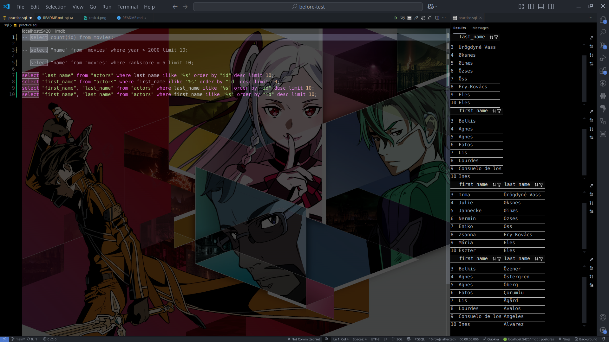
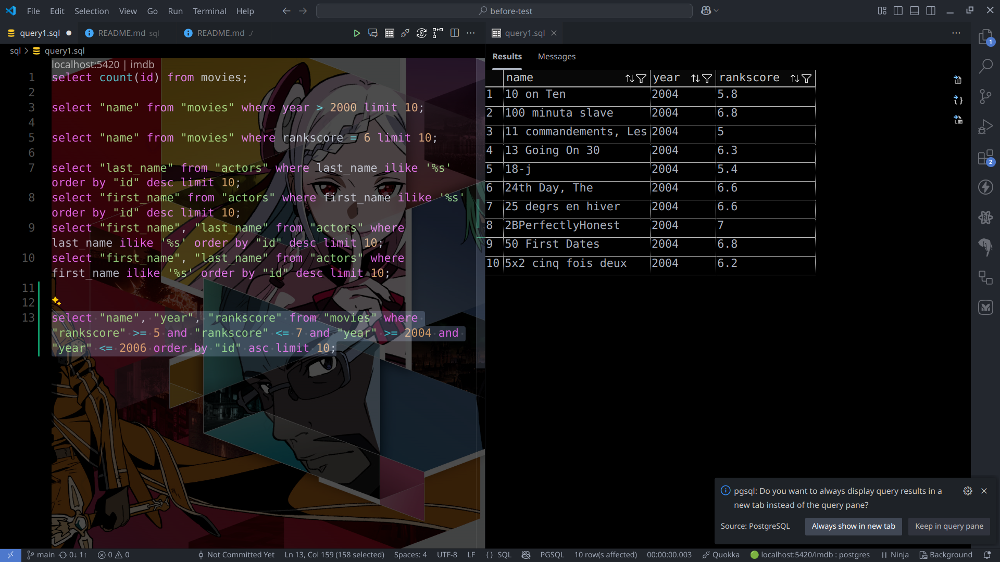
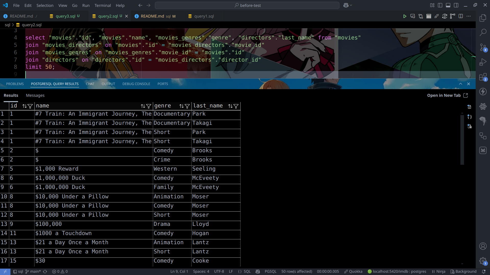
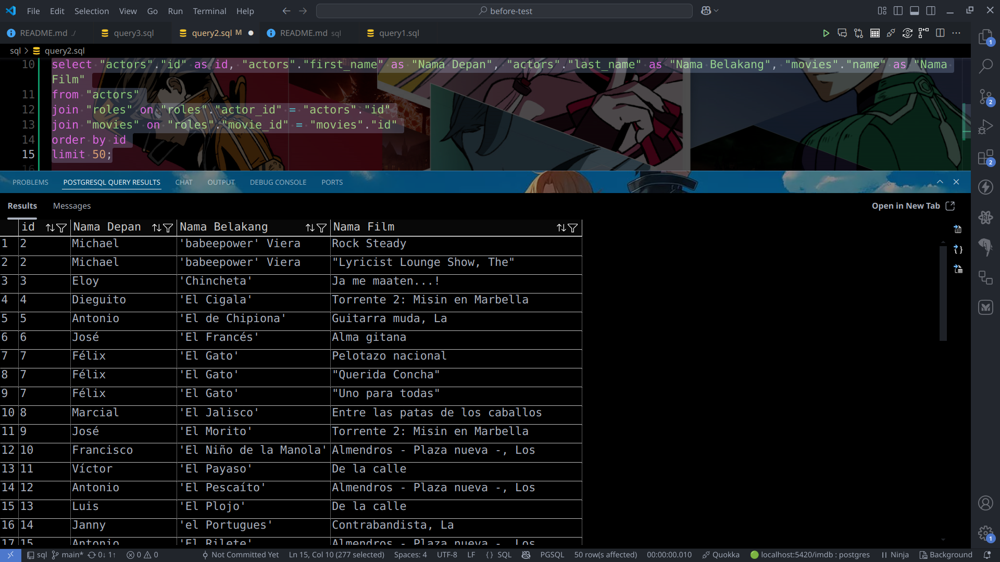
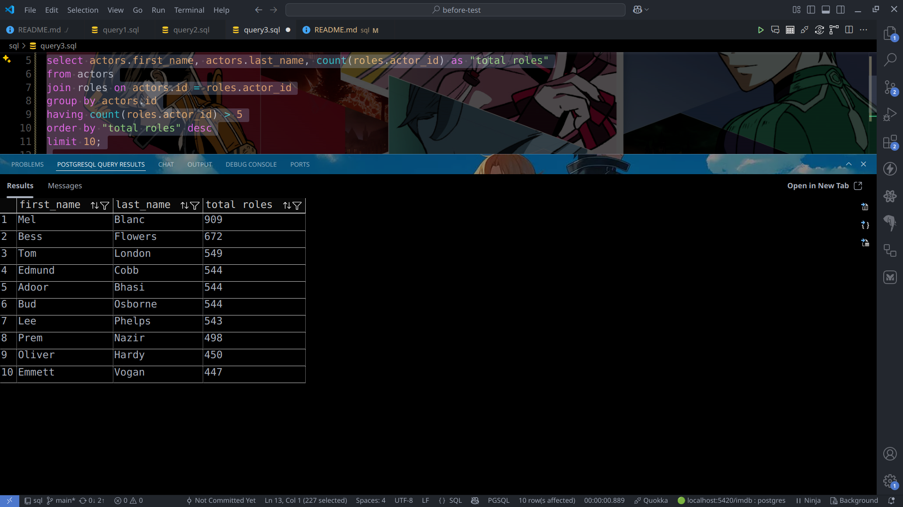

# Postgresql Minitask

## query 1

* Task 1: mencari movie dengan tahun rilis lebih dari tahun 2000

* Task 2: mencari aktor dengan akhiran nama 's'

* Task 3: mencari movie dengan rating diantara 5 dan 7 dan tahun rilis 2004 sampai 2006

* menghitung jumlah movie dengan rating 6

## query 2

* melakukan join director dan genres ke table movies, limit keluarannya sebanyak 50

* melakukan join movies dan roles berdasarkan table actors

## query 3

* Mendapatkan director, berapa genre yang di-direct

* Mendapatkan actor yang memiliki roles lebih dari lima

* Mendapatkan director paling producttive sepanjang masa

* Mendapatkan tahun tersibuk sepanjang masa

* Mendapatkan movies dengan genres yang dibuatkan menjadi 1 column (value dipisah dengan koma) dengan menggunakan string_agg
